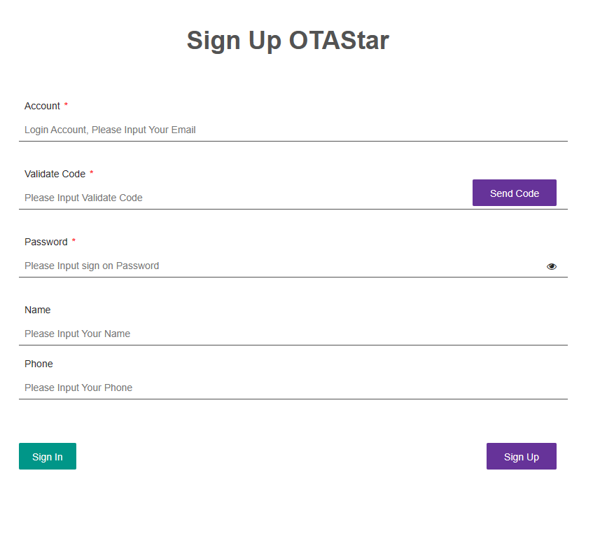
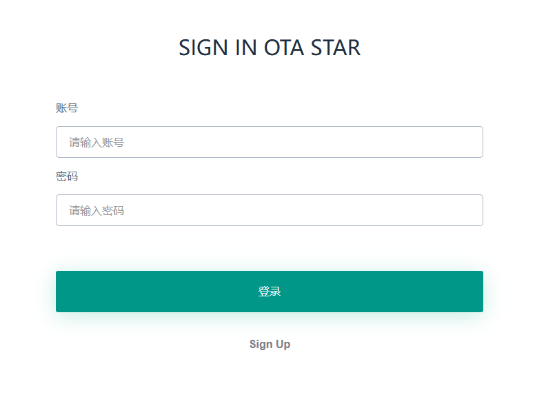
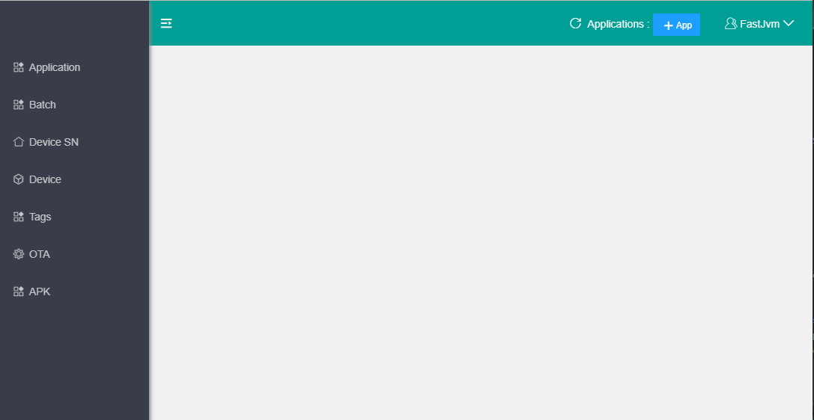
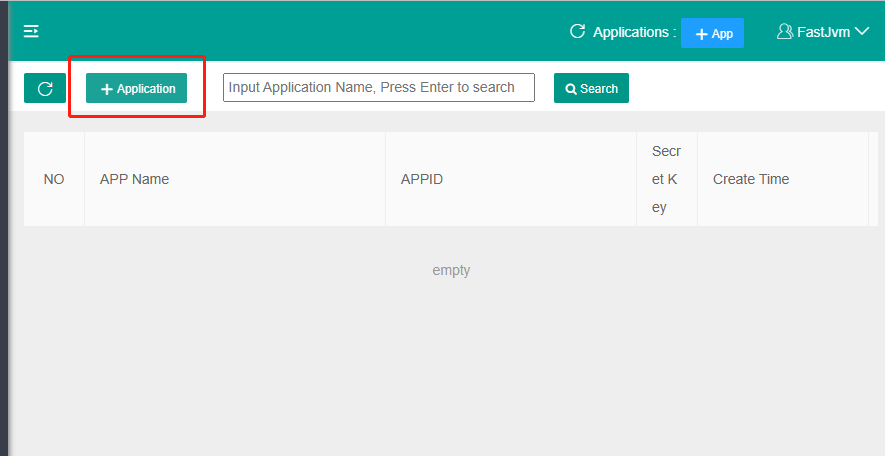
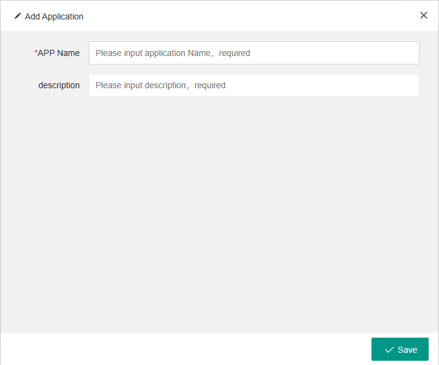
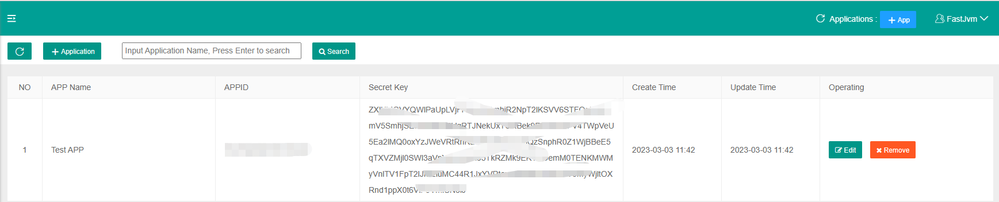

# OTAstar

# 		——Best ota uprade application for your android


## 1. introduction

OTAstar is an android and multi-user OTA upgrade program. You will need obtain the appropriate appid and key from our platform services. Configure in AppConfig to ensure that your device can normally request server upgrades and other resources. Please refer to how to obtain appid and secret key (How to obtain appid and secret key).

## 2. Supported Devices

RK3566 RK3568 RK3588 S905x4

## 3. Obtain appid and secret key

### sign up our platform account

#### Open the page 

```html
http://ota.fast.szhyy.xyz/register.html
```



Enter the correct email address to obtain the email verification code. then set your sign up password, and your name, and phone. then click the sign up button to register our platform user. if register success this page will be forward to http://ota.fast.szhyy.xyz/login.html .like .



Enter the account and password you just registered and click Log in


### create application  and obtain appid and secretKey



if you sign in the Background management page , There are two ways you can create an app, 

First, click "Application" Menu item open in the left menu bar enter application list page . then click "+Application" button in the top bar. like this



In the second way, click the "+App" button on the right of the navigation bar at the top of the home page to create an application， like this.


then you open the create application page, All you need to do is type in the name of the app and a description of what it should be, then click the "save" button, like this.



When you have successfully created an app, it will be displayed in the application list. like this




Copy APPID and SecretKey to the fields corresponding to the AppConfig class of the android ota update client development code, please look  the "How to configuration appid and secret key " topic


## 4. Configuration appid and secret key 

Open the AppConfig file in the cn/syzbtech/ota package, then set your Appid and secret key into the APPID field and SECRET_KEY field of this class

```
public class AppConfig {
    public static final String HOST = "";
    public static final String APPID="";
    public static final String SECRET_KEY="";
}
```

## 5. Install as system application

```
adb root
adb remount
adb push <the path of your apk > /system/app
```

